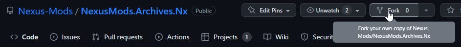
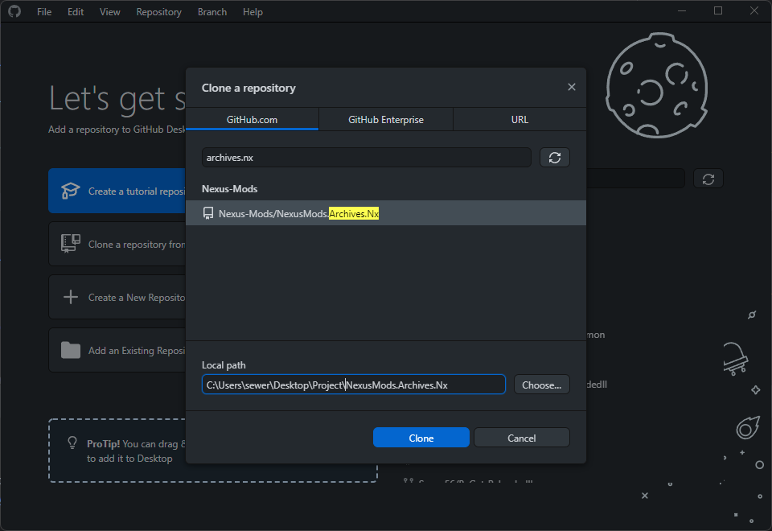
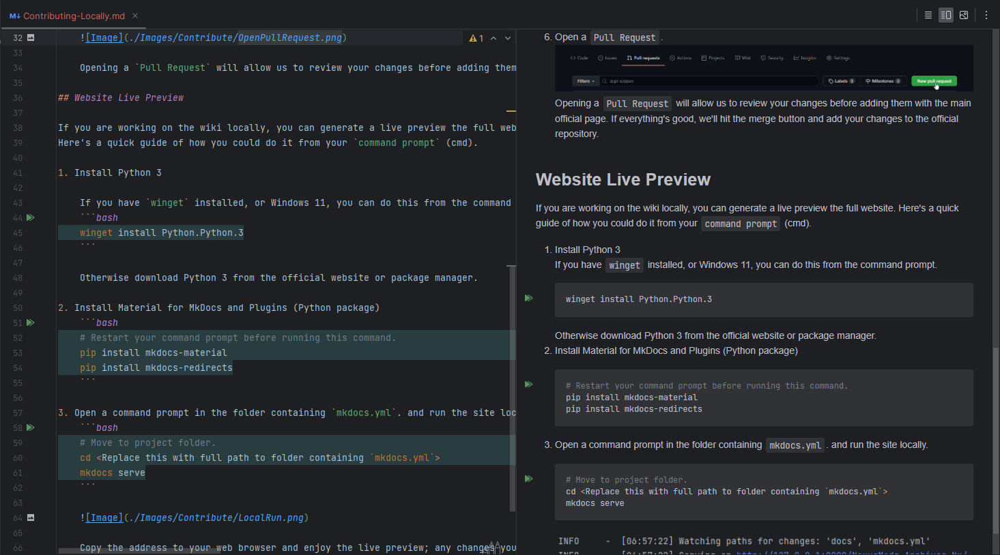
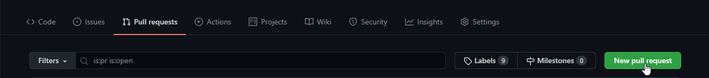
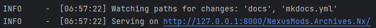

# Contributing to the Wiki: Locally

!!! info

    This page shows you how to contribute to any documentation page or wiki.

## Tutorial

You should learn the basics of `git`, an easy way is to give [GitHub Desktop (Tutorial)](https://www.youtube.com/watch?v=77W2JSL7-r8) a go.
It's only 15 minutes 😀.

1. Create a GitHub account.
2. Fork this repository:

    

    This will create a copy of the repository on your own user account, which you will be able to edit.

3. Clone this repository.

    For example, using GitHub Desktop:
    

4. Make changes inside the `docs` folder.

    

    Consider using a [*Markdown Cheat Sheet*](https://github.com/adam-p/markdown-here/wiki/Markdown-Cheatsheet) if you are new to markdown.

    I recommend using a markdown editor such as `Typora`.
    Personally I just work from inside `Rider`.

5. Commit the changes and push to GitHub.

6. Open a `Pull Request`.

    

    Opening a `Pull Request` will allow us to review your changes before adding them with the main official page. If everything's good, we'll hit the merge button and add your changes to the official repository.

## Website Live Preview

If you are working on the wiki locally, you can generate a live preview of the full website.

### Quick Start (Recommended)

**Prerequisites:** Python 3.7+ required.

- Linux: Typically pre-installed
- macOS: Download from [python.org](https://python.org/)
- Windows: Run `winget install Python.Python.3` in command prompt
    - Or download manually from [python.org/downloads](https://python.org/downloads/)

Run the automated setup script from the project root:

```bash
python3 start_docs.py
```

This script will:

- Create a virtual environment if needed
- Install all required dependencies
- Start the MkDocs live server at http://127.0.0.1:8000 (paste into browser)

### Manual Setup

If you prefer to set up manually without scripts:

1. **Install Dependencies**
   
    ```bash
    # Navigate to the docs directory
    cd doc/docs/Reloaded
    
    # Create virtual environment (only needs to be done once)
    python3 -m venv venv
    
    # Activate virtual environment (do this each time you work)
    source venv/bin/activate  # On Windows: venv\Scripts\activate
    
    # Install requirements
    pip install -r docs/requirements.txt
    ```

2. **Start Live Server**
   
    ```bash
    mkdocs serve --livereload
    ```

    

    Copy the address to your web browser and enjoy the live preview; any changes you save will be shown instantly.

